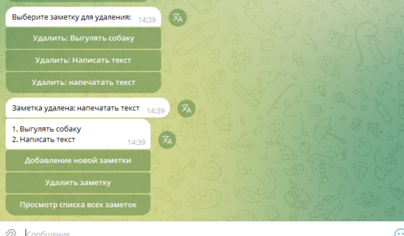

# telegram_bot
Домашнее задание по теме 1.3.3 Разработка телеграмм ботов ч.2

Создать Telegram-бота на Aiogram, который позволит пользователю управлять простыми заметками. 
Бот должен поддерживать добавление, просмотр и удаление заметок, а также использовать машину состояний и инлайн-клавиатуры для удобного взаимодействия.

Основные задачи: Реализовать Telegram-бота, который будет поддерживать три основные функции:

Добавление новой заметки.

Просмотр списка всех заметок.

Удаление заметки.

Для управления процессом создания и удаления заметок используйте машину состояний.
Определение машины состояний:
Создайте StatesGroup для управления состояниями:
Start: Начальное состояние, где пользователь выбирает действие (добавить, просмотреть или удалить заметки).
AddNote: Состояние, когда бот ожидает от пользователя текст новой заметки.
DeleteNote: Состояние, когда пользователь выбирает заметку для удаления.

Для удобного взаимодействия используйте инлайн-клавиатуры.
Главное меню: Клавиатура с кнопками "Добавить заметку", "Просмотреть заметки", "Удалить заметку".
Клавиатура для удаления: Создавайте динамически, чтобы отобразить список всех заметок, которые можно удалить.